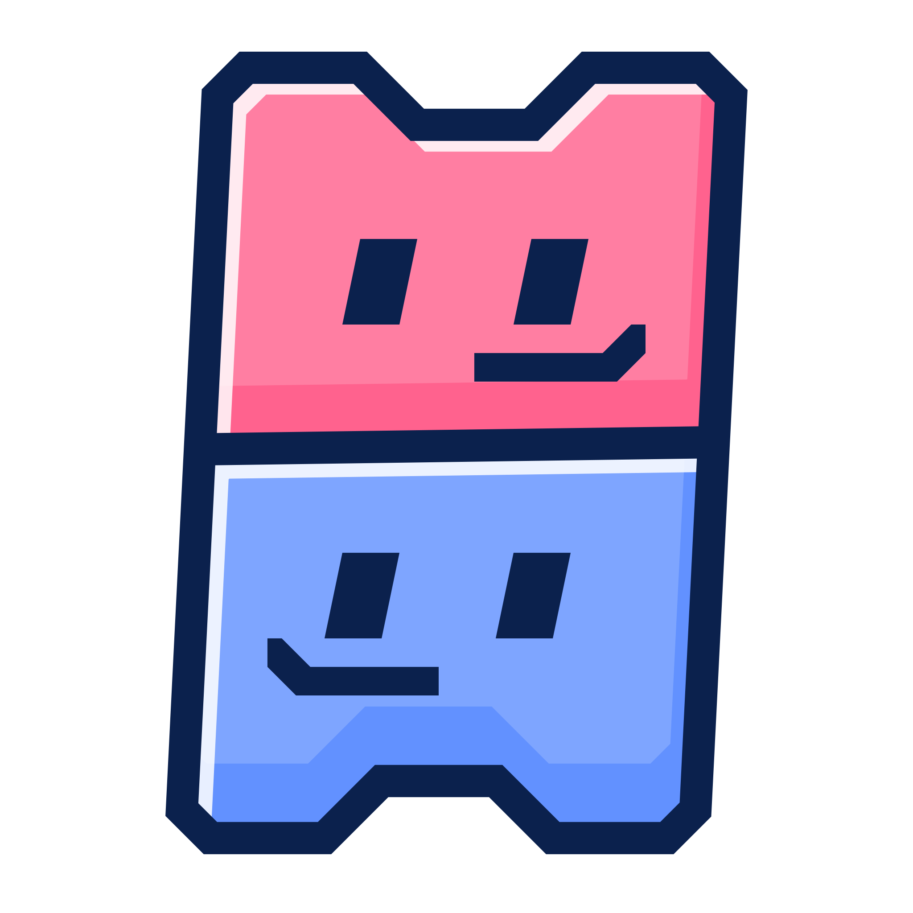
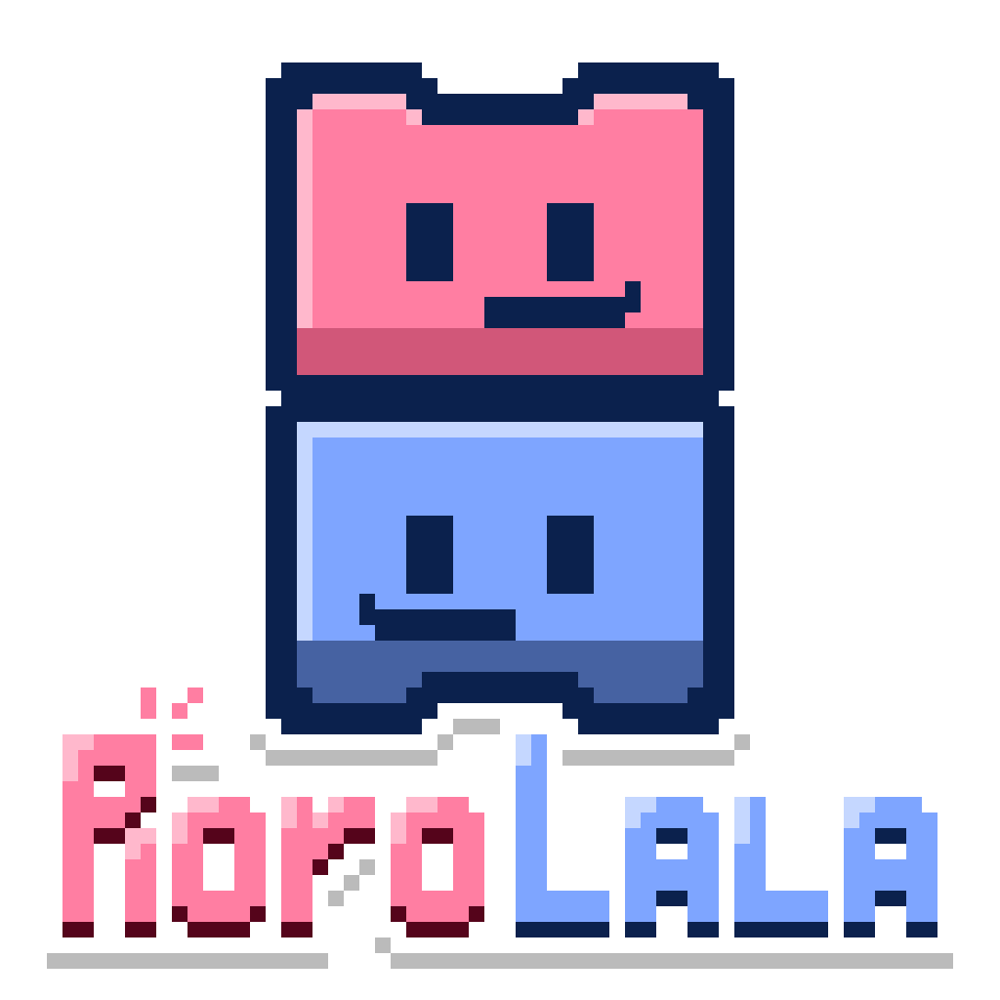
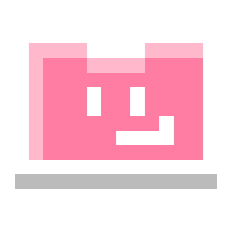
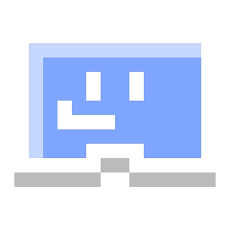

<p align="center">
  <!---->
  
</p>

<p align="center">
    <b>R</b>eality-<b>O</b>riented, <b>L</b>ayout-<b>A</b>gnostic 
</p>

> [!WARNING]
> 
> It is being written from nothing and is under active development. Nothing here is usable yet.

<h2>  Rorolala VCS </h2>

Rorolala is a version control system for artists that treats "structure" and "content" separately:

- **The version history records only file content, not file structure.** How directories and filenames are organized does not enter the history; only the file content that carries the creative work is recorded, tracked, and restored. As a result, renaming, moving, or reorganizing assets does not affect the history, and artists do not have to conform to a particular directory structure just to preserve history.

- **On-demand pulling.** A repository can fetch only the part of the resources needed at the moment, without having to fully sync the entire project first. For drawing, modeling, or rendering projects that reach tens of GB in size, this can significantly reduce the overhead of collaboration and switching between scenes.

- **Immutable data in distributed storage, mutable data under centralized management.** Creative outputs that no longer change after being written (such as finished images, export results, and historical versions) are stored in a content-addressed manner in distributed storage, which allows natural deduplication and makes it easy to share among multiple people; whereas data that is still changing frequently and needs unified coordination (such as file owners, version pointers, and other mutable data) is managed centrally to ensure consistency among members.

<h2>  Install & Deploy </h2>

**Rola is under active development! So no prebuilt versions are available at the moment.**

If you are interested, you can pull the source code and build it. The dependency requirements are as follows:

| Dependency | Version |
|---|---|
| `cargo` + `rustc` | `≥ 1.85` |
| `cc`/`gcc` | Any |
| .NET SDK | `≥ 10.0.100`|
| .NET 8 Targeting Pack | 8.0 SDK |
| | or restore `Microsoft.NETCore.App.Ref 8.0.x` via `NuGet` |
| `NuGet` packages | `Avalonia 12.1.3`, `Avalonia.Desktop`, `Avalonia.Themes.Simple`, etc. |

After pulling the project, you can build it with the following command:

```bash
./run.sh export # On Windows devices, use .\run.ps1 export
```

Once the build is complete, the artifacts will be exported to the `build/` directory.

<h2>  The Server </h2>

Rorolala's remote collaboration relies on the `rola-daemon` server for management. You need to deploy it at a location reachable on your network using the following commands:

```bash
# Create a remote Vault and run it in its directory
rola create -v my-vault
cd my-vault && rola-daemon
```

<h2>  License </h2>

This project is released under the **MIT License**. Anyone is free to use, copy, modify, merge, publish, distribute, sublicense, and even sell copies of this software, with the sole requirement that the original copyright notice and permission notice be retained in all copies or substantial portions of the software.

See [LICENSE](./LICENSE) for the full terms.
